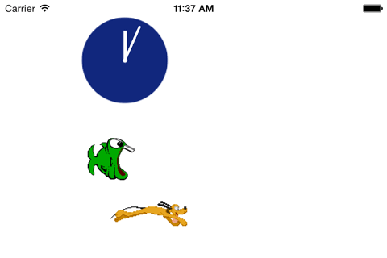

P2MSStoryboard (OnGoing)
==============

This libray is not meant for creating game. It provides a quick and easy way for creating animated object in uiview with few lines of codes.

It works on IOS 4.3+

***In Progress --> P2MSAnimationObject***

###Usage For P2MSObject
    P2MSObject *object = [[P2MSObject alloc]init];
    object loadObject:@"Animation String" inView:canvasView withTag:imgTag];
    
    //eg
    [object loadObject:@"default pluto_1.png|pluto_2.png|pluto_3.png|pluto_4.png|pluto_5.png|pluto_6.png|pluto_7.png|pluto_8.png 95,49 10%,50% 1,1,0 move:0.1,9,70%,50%|animate:0,0,pluto_2_1##pluto_2_2##pluto_2_3,1,0,75%" inView:self.view withTag:1];

implements *"P2MSObjectDelegate"* to receive messages from *"P2MSObject"* instance.

####Animation String Format
***object_type*** *animation_images* ***width,height*** initXPos,initYPos ***init_alpha,animation_duration,animation_count*** animation_sequences_separated_by\_|\_character

***object_type (object behavior)***

	- default, drag, tap, disabled
	- can mix behavior with underscore (e.g - "drag_tap" means draggable and clickable)

***animation_images***

	- can be one image or multiple images separated by "##" character
	- last image will be retained when the image animation is stopped

***width,height***

	- initial width and height of the object (don't accept percentage values)
	
***initXPos,initYPos***

	-  initial X and Y positions of the object (top-left corner)
	- positions can be float value or percentage (proportion of the parent view width and height)

*If you use the percentage value, beware to load/animate the object after the screen rotation.*

*initX = objectView.superview.bounds.size.width \* percentageX / 100.f* 
*initY = objectView.superview.bounds.size.height \* percentageY / 100.f*

***init_alpha,animation_duration,animation_count***

	- init_alpha -> initail alpha value of the object
	- animation_duration -> the time (in seconds) duration required to complete the one round of mulitple images animation. (value for "animationDuration" property of UIImageView)
	- animation_count - number of times to repeat the animation (value for "animationRepeatCount" property of UIImageView) 
	- set the zero value for "animation_count" will result the maximum repeat count (CGFLOAT_MAX)

If there is only one image in "animation_images", you can ignore the values for *animation_duration* and *animation_count*

***animation_sequences***

Each animation_sequence has the following format.

	animation_verb:delay_time,animation_duration,instruction_1,instruction_2,...,instruction_n

You can create 

- sequential animations by combining multiple animation_sequence using "|" as separator.
- concurrent (don't wait for the previous animation to finish) animations by using "--" as separator.

***delay_time*** - time to wait before the animation starts (in seconds) 
***animation_duration*** - duration of the animation (in seconds) 
***instruction*** - instruction related to animation_verbs  
###*animation_verbs*
**move** - move to the position specified by *(finalXPos,finalYPos)*

	move:delay_time,animation_duration,finalXPos,finalYPos
	- eg: move:0,10,50%,200

**move_scale** - move and scale to the position and size specified by (finalXPos,finalYPos,finalWidth,finalHeight)

	move_scale:delay_time,animation_duration,finalXPos,finalYPos,finalWidth,finalHeight
	- eg: move_scale:0.1,14.5,200,90%,200,300

**alpha** - alpha value of the object

	alpha:delay_time,animation_duration,alpha_value
	- eg: alpha:0,1,1.0 (fade-in animation)

**animate** - animate object with the (existing or new) images and parameters provided
*(values in parenthesis are optional and will use the existing values if not provided)*	
	
	animate:delay_time,animation_duration,(images),(animationDuration),(animationCount),(newPosX),(newPosY),(newWidth),(newHeight)
	
	- will use the new image size as newWidth and newHeight if you leave them blank.
	(eg: 
		animate:1,0,img1##img2
		will use the existing width and height
		
		animate:1,0,img1##img2,,,,,,,
		newWidth = img1.width, newHeight = img1.height
		
		animate:1,0,img1##img2,,,,,,200,300
		newWidth = 200, newHeight = 300
	)
 

	- eg: //animatin_duration value always should be 0

	//animate object with existing images and parameters
	animate:1,0
	
	//with new images (separator ##) and existing parameters (newWidth and newHeight <- first image's size)
	animate:1,0,pluto_1.png##pluto_2.png#pluto_3.png,,,,,,
	
	//existing images and  with new parameters
	animate:1,0,,2,3
	
	//animate existing images in new position
	animate:1,0,,,,100,200

**replace** - replace image with new image

	replace:delay_time,animation_duration,new_image_name,(posX),(posY),(newWidth),(newHeight)
	- eg: replace:0,0,pluto_1.png
		//animation_duration is always zero

####Transform animations

**rotate** - rotate the object

	rotate:delay_time,animation_duration,degree
	- eg: rotate:0,1,90 //rotate object to 90 degree

**flip_rotate** - flip and rotate the object

	flip_rotate:delay_time,animation_duration,flipX,flipY,degree
	- eg: 
		//flip horizontal and rotate 90 degree
		flip_rotate:0,1,-1,1,90

**clock_rotate** - rotate clock-wise on z-axis (simulate clock rotation)

	clock_rotate:delay_time,animation_duration,repeat_count
	- eg: clock_rotate:0.1,10,1 (rotate clock-wise for one time)

**reset_transform** - reset the rotation & flip transform
 
*Call reset_transform (if appropriate) before doing another animation if transform animations are done before*

	reset_transform:delay_time,animation_duration(always zero)
	- eg: reset_transform:1,0

####Example
	P2MSObject *object = [[P2MSObject alloc]init];
    [object loadObject:@"default pluto_1.png##pluto_2.png##pluto_3.png##pluto_4.png##pluto_5.png##pluto_6.png##pluto_7.png##pluto_8.png 95,49 10%,50% 1,1,0 move:0.1,7,70%,50%|animate:0,0,pluto_2_1##pluto_2_2##pluto_2_3,1,0,75%,,," inView:self.view withTag:1];
    
    P2MSObject *clockBase = [[P2MSObject alloc]init];
    [clockBase loadObject:@"default clock_base.png 109,109 100,20 0 alpha:1,0.5,1.0" inView:self.view withTag:2];
    
    P2MSObject *hour = [[P2MSObject alloc]init];
    [hour loadObject:@"default hour.png 4,76 153,37 0,0,0 alpha:1,0.5,1.0|clock_rotate:0,120,0" inView:self.view withTag:3];
    
    P2MSObject *minute = [[P2MSObject alloc]init];
    [minute loadObject:@"default minute.png 3,93 153,28 0,0,0 alpha:1,0.5,1.0|clock_rotate:0,10,0" inView:self.view withTag:4];
    
    P2MSObject *fishObj = [[P2MSObject alloc]init];
    [fishObj loadObject:@"default fish_3.png##fish_2.png##fish_1.png 59,52 10%,170 1,1,0 move:1,7,80%,175|replace:0,0,fish.png|flip_rotate:1,0,-1,1,-30|move:0,10,5%,100|reset_transform:0.1,0" inView:self.view withTag:5];

 

###Credits
Sprite Images - <a href="https://archive.org/details/ug-sprite-sheet-collection-v2">Link</a>

###Contributions
- Contributions and suggestions are welcome
